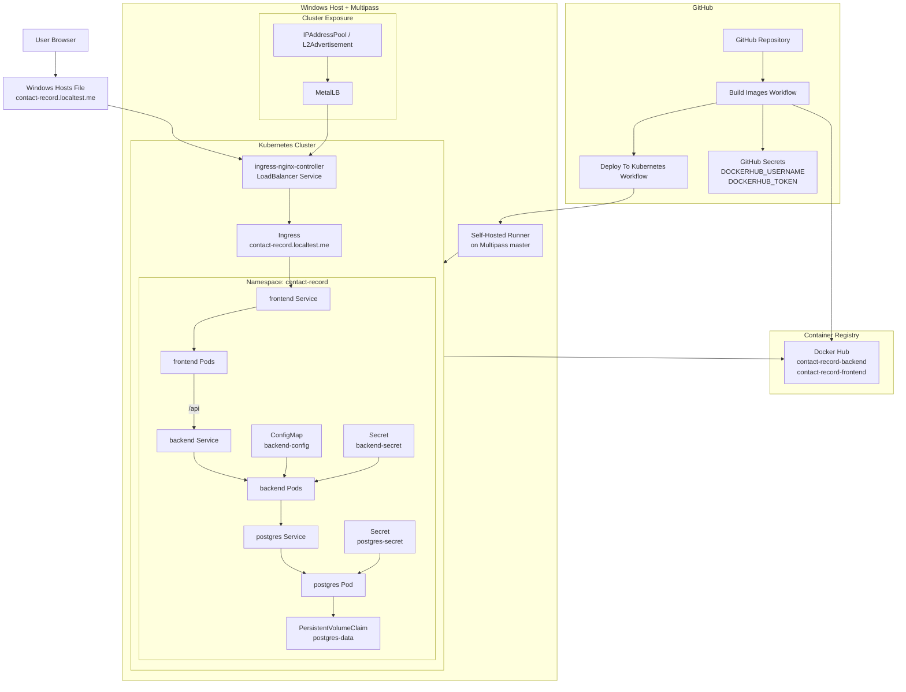

# Kubernetes Deployment Guide

This document explains how the application is deployed to Kubernetes using the manifests in this repository.

It covers:

- `kind` for local development
- Multipass or kubeadm-style multi-node clusters
- image handling
- secrets and configuration
- rollout verification

## Related Guides

- Multipass setup: [k8s/multipass/README.md](/home/ninad/Projects/Contact-Record-Keeping-Application/k8s/multipass/README.md)
- MetalLB setup: [k8s/external-services/metal-lb/README.md](/home/ninad/Projects/Contact-Record-Keeping-Application/k8s/external-services/metal-lb/README.md)
- GitHub Actions and runner setup: [.github/README.md](/home/ninad/Projects/Contact-Record-Keeping-Application/.github/README.md)

## Architecture

Deployed components:

1. `frontend` Deployment
2. `backend` Deployment
3. `postgres` Deployment
4. `Ingress`

Traffic flow:

1. client reaches `Ingress`
2. ingress sends traffic to `frontend`
3. frontend proxies `/api/*` to `backend`
4. backend connects to `postgres`

## Detailed Architecture Diagram



### Architecture Notes

- The browser reaches the application through `contact-record.localtest.me`.
- On Multipass, Windows resolves that hostname through the hosts file to the MetalLB-assigned ingress IP.
- `ingress-nginx-controller` exposes the application externally.
- The Kubernetes `Ingress` routes external traffic only to the `frontend` service.
- The Angular frontend is served by nginx and proxies `/api/*` traffic internally to the backend service.
- The backend is not exposed directly outside the cluster.
- Backend runtime configuration comes from `backend-config` and `backend-secret`.
- PostgreSQL credentials come from `postgres-secret`.
- PostgreSQL persists data through the `postgres-data` PVC.
- The `Build Images` workflow pushes backend and frontend images to Docker Hub.
- The `Deploy To Kubernetes` workflow runs on the self-hosted runner installed on the Multipass master node.
- The cluster pulls images from Docker Hub during deployment or rollout.

## Manifest Inventory

- `k8s/namespace.yaml`
- `k8s/postgres.yaml`
- `k8s/postgres-secret.example.yaml`
- `k8s/backend-configmap.yaml`
- `k8s/backend-secret.example.yaml`
- `k8s/backend.yaml`
- `k8s/frontend.yaml`
- `k8s/ingress.yaml`
- `k8s/kustomization.yaml`

## Cluster Requirements

Before applying the manifests, the cluster must have:

- a working `kubectl` context
- dynamic storage or a usable `StorageClass`
- an `nginx` ingress class
- access to the frontend and backend images

Check:

```bash
kubectl get nodes -o wide
kubectl get storageclass
kubectl get ingressclass
```

## Option 1: kind

### Create the cluster

```bash
kind create cluster --name contact-record --config kind/kind-config.yaml --wait 2m
kubectl cluster-info --context kind-contact-record
```

### Install ingress-nginx

```bash
kubectl apply -f https://raw.githubusercontent.com/kubernetes/ingress-nginx/controller-v1.14.3/deploy/static/provider/kind/deploy.yaml
kubectl wait --namespace ingress-nginx \
  --for=condition=ready pod \
  --selector=app.kubernetes.io/component=controller \
  --timeout=120s
```

### Build and load images

```bash
docker build -t contact-record-backend:local ./backend
docker build -t contact-record-frontend:local ./frontend

kind load docker-image contact-record-backend:local --name contact-record
kind load docker-image contact-record-frontend:local --name contact-record
```

### Apply secrets

```bash
cp k8s/postgres-secret.example.yaml /tmp/postgres-secret.yaml
cp k8s/backend-secret.example.yaml /tmp/backend-secret.yaml
```

Edit the copies and apply them:

```bash
kubectl apply -f /tmp/postgres-secret.yaml
kubectl apply -f /tmp/backend-secret.yaml
```

### Deploy

```bash
kubectl apply -k k8s/
```

### Verify

```bash
kubectl get all -n contact-record
kubectl get pvc -n contact-record
kubectl get ingress -n contact-record
kubectl rollout status deployment/postgres -n contact-record
kubectl rollout status deployment/backend -n contact-record
kubectl rollout status deployment/frontend -n contact-record
```

### Access

```text
http://contact-record.localtest.me
```

## Option 2: Multipass Or kubeadm-Style Cluster

For a full cluster bootstrap guide, use:

- [k8s/multipass/README.md](/home/ninad/Projects/Contact-Record-Keeping-Application/k8s/multipass/README.md)

At deployment time, the important differences from `kind` are:

- images must be pulled from a registry
- storage must be installed in the cluster
- ingress exposure usually requires MetalLB or NodePort

### Build and push images

```bash
docker build -t YOUR_REGISTRY/contact-record-backend:v1 ./backend
docker build -t YOUR_REGISTRY/contact-record-frontend:v1 ./frontend

docker push YOUR_REGISTRY/contact-record-backend:v1
docker push YOUR_REGISTRY/contact-record-frontend:v1
```

Update the image fields in:

- [backend.yaml](/home/ninad/Projects/Contact-Record-Keeping-Application/k8s/backend.yaml)
- [frontend.yaml](/home/ninad/Projects/Contact-Record-Keeping-Application/k8s/frontend.yaml)

Or let the GitHub deploy workflow set the images dynamically.

### Apply secrets

```bash
cp k8s/postgres-secret.example.yaml /tmp/postgres-secret.yaml
cp k8s/backend-secret.example.yaml /tmp/backend-secret.yaml
```

Edit and apply:

```bash
kubectl apply -f /tmp/postgres-secret.yaml
kubectl apply -f /tmp/backend-secret.yaml
```

### Deploy

```bash
kubectl apply -k k8s/
```

### Verify

```bash
kubectl get all -n contact-record
kubectl get pvc -n contact-record
kubectl get ingress -n contact-record
kubectl rollout status deployment/postgres -n contact-record
kubectl rollout status deployment/backend -n contact-record
kubectl rollout status deployment/frontend -n contact-record
```

## Secrets And Configuration

### ConfigMap

[backend-configmap.yaml](/home/ninad/Projects/Contact-Record-Keeping-Application/k8s/backend-configmap.yaml) contains non-secret runtime values such as:

- datasource URL
- JPA settings
- CORS origins

### Secrets

[backend-secret.example.yaml](/home/ninad/Projects/Contact-Record-Keeping-Application/k8s/backend-secret.example.yaml) contains:

- backend database username
- backend database password
- JWT secret
- JWT expiration

[postgres-secret.example.yaml](/home/ninad/Projects/Contact-Record-Keeping-Application/k8s/postgres-secret.example.yaml) contains:

- database name
- database username
- database password

Never commit real secret values.

## Common Commands

```bash
kubectl apply -k k8s/
kubectl get all -n contact-record
kubectl get pvc -n contact-record
kubectl get ingress -n contact-record
kubectl logs -n contact-record deploy/backend
kubectl logs -n contact-record deploy/frontend
kubectl logs -n contact-record deploy/postgres
kubectl describe pod -n contact-record -l app=backend
kubectl describe pod -n contact-record -l app=frontend
kubectl describe pod -n contact-record -l app=postgres
```

## Rollback

```bash
kubectl rollout undo deployment/backend -n contact-record
kubectl rollout undo deployment/frontend -n contact-record
```

## Troubleshooting

### PostgreSQL pod is Pending

Check:

```bash
kubectl get storageclass
kubectl get pvc -n contact-record
kubectl describe pvc postgres-data -n contact-record
```

### Backend cannot connect to PostgreSQL

Check:

```bash
kubectl logs -n contact-record deploy/backend
kubectl logs -n contact-record deploy/postgres
kubectl get secret postgres-secret -n contact-record
kubectl get secret backend-secret -n contact-record
```

### Frontend loads but API calls fail

Check:

```bash
kubectl logs -n contact-record deploy/frontend
kubectl logs -n contact-record deploy/backend
kubectl describe ingress -n contact-record
```

### Ingress exists but app is unreachable

Check:

```bash
kubectl get svc -n ingress-nginx
kubectl get ingress -n contact-record
kubectl describe ingress -n contact-record
```

On Multipass, also verify the network model and MetalLB or NodePort exposure.
